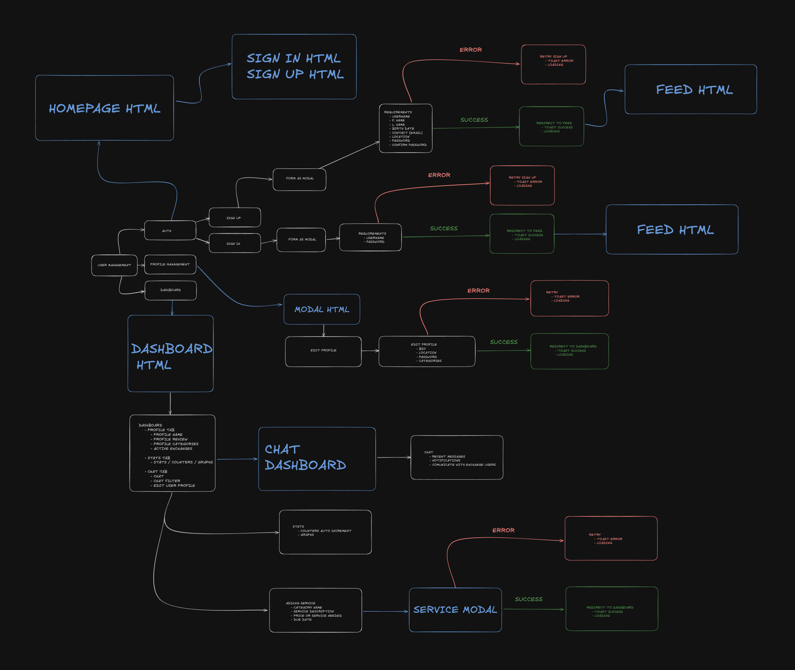
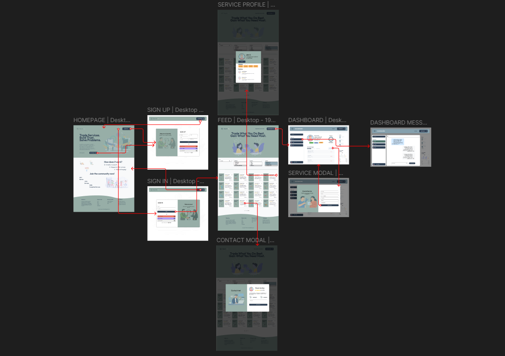

    

# Bartrify


Bartrify is a digital platform where users can exchange services for free. It fosters a community built on trust, skill-sharing, and collaboration.


---

### **Repo:**
[/Bartrify-final-project](https://https://github.com/Huniity/Bartrify-final-project)

---

## 📌 Features

- 👤 User registration, login, and profile editing
- 🔄 Post and browse service listings
- ✉️ Private messaging between users
- 🌟 Leave and receive reviews (text + star rating)
- 📊 Dashboard with user stats and service metrics
- 🛠 Modal-based interface for contact, messaging, reviews, and comments

---

## 🏗 Tech Stack

- **Backend**: Django 5+
- **Database**: PostgreSQL
- **Frontend**: HTML, CSS, Javascript, Bootstrap, Tailwind
- **Hosting**: Coming Soon
---

## 🗂 Project Structure

<pre>
├── .devcontainer/
├── .pytest_cache/
├── bartrify/
│ ├── pycache/
│ ├── tests/
│ ├── init.py
│ ├── asgi.py
│ ├── settings.py
│ ├── urls.py
│ ├── wsgi.py
├── core/
│ ├── pycache/
│ ├── management/
│ │ └── commands/
│ │ └── init.py
│ ├── migrations/
│ ├── serializers/
│ │ ├── date.py
│ │ ├── password.py
│ │ ├── request.py
│ │ ├── review.py
│ │ ├── service.py
│ │ └── user.py
│ ├── templates/
│ │ └── core/
│ │ └── modals/
│ │ └── base.html
│ ├── views/
│ │ ├── init.py
│ │ ├── auth.py
│ │ ├── pages.py
│ │ ├── password.py
│ │ ├── request.py
│ │ ├── review.py
│ │ ├── service.py
│ │ ├── user.py
│ ├── admin.py
│ ├── apps.py
│ ├── consumers.py
│ ├── mixins.py
│ ├── models.py
│ ├── routing.py
│ ├── tests.py
│ ├── urls.py
│ └── views.py
├── custom_static/
│ ├── css/
│ ├── img/
│ └── js/
├── media/
├── staticfiles/
├── .dockerignore
├── .env
├── .gitignore
├── CHANGELOG.md
├── compose.yaml
├── db.sqlite3
├── Dockerfile
├── LICENSE
├── Makefile
├── manage.py
├── poetry.lock
├── pyproject.toml
└── README.md
</pre>

---

## 🔧 Installation & Setup

```bash
git clone https://github.com/Huniity/Bartrify-final-project.git
cd Bartrify-final-project
make bartrify.rise

#Wait for the magic to happen.

This make command will:
    -Create a default .env file for development only.
    -Rise the containers.
    -Remove any orphan container you might have up and lost in limbo.
    -Run any migrations.
    -Run any migrates.
    -Populate the database with fake data for users, reviews and services.
    -Populate the database with fake data for chatrooms and messages.
    -Open your browser on the homepage.
    -Re-open logs so you can have watching all going alright.
```

---

## 🚀 Usage Guide

- Sign up and edit your profile
- Post or browse service listings
- Message users privately through modal interface
- Leave reviews and star ratings after service exchanges
- Use the dashboard to track your stats and interactions


---

## 🧪 Testing
# Run tests using:

```bash
poetry run pytest
```

Tests may include models, views, forms, and integration tests.

---

## 🤝 Contributing
Fork the repo and clone it\
Create a new branch:

```bash
git checkout -b feature/YourFeature
Make changes and commit:
```
```bash
git commit -m "Add YourFeature"
Push and create a pull request
```

Please follow existing style and structure. Add tests for new features.

--- 

## 🔮 Future Plans

- Deployment (cloud hosting)
- In-app notifications
- Better search & filters
- User reputation badges
- Mobile optimization
- Community discussion features

---

## 📜 License

This project is licensed under the MIT License – see the LICENSE file for details.

---

## 🙏 Acknowledgments

- Django community and open source contributors
- Barter platform inspirations
- Reviewers and early testers
- Project team and mentors (if any)


<sub>Made with ❤️ by the Bartrify team. Share your skills. Empower your community.</sub>\
\
\
\
\
\
\
\
\

